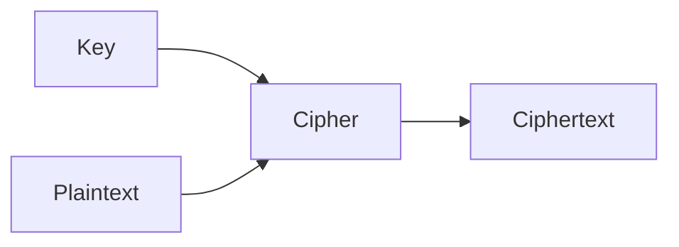
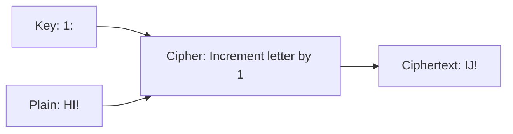

#course_cs50

- The science of encrypting information
- Encryption: scrambling information so only you and the recipient can read it

- We want to use a *cipher*, an algorithm for scrambling information in a reversible way, to encrypt plain text into *cipher text* - your scrambled message
    - Ciphers take as input the plain text message, as well as a *key* which is generally a number that is made up of a large number of bits

- For example - considering the *Caesar cipher* (using $n = 1$ instead of $3$ which is the original)
    - Another method is to use $n = 13$ which is referred to as *ROT13*

- There are much more sophisticated ciphers used though.

- Decryption: just a reverse of the process used to _encrypt_ the message.

