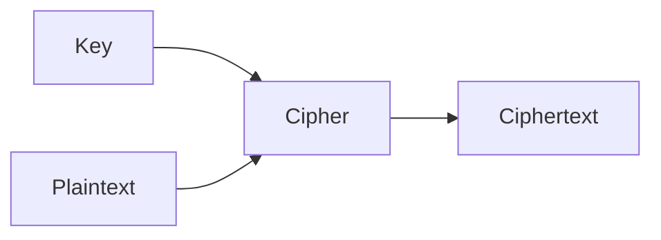
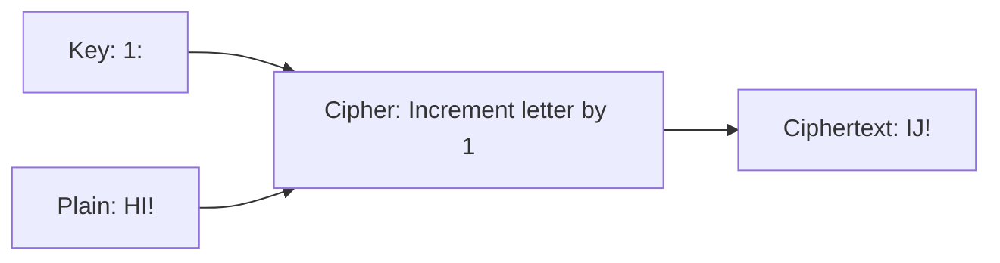
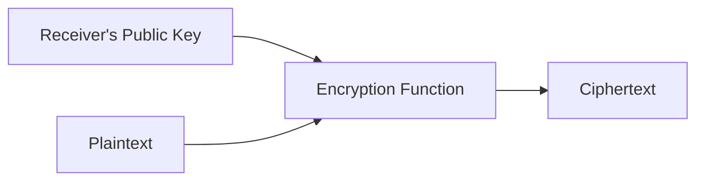
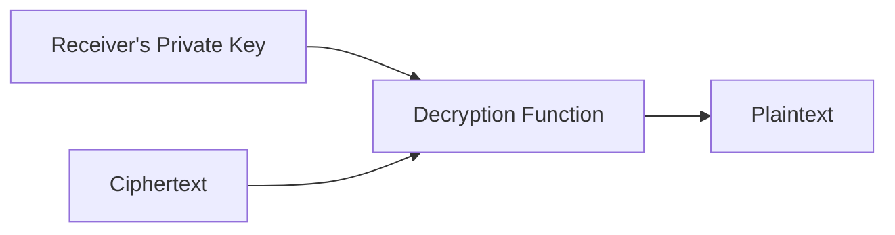
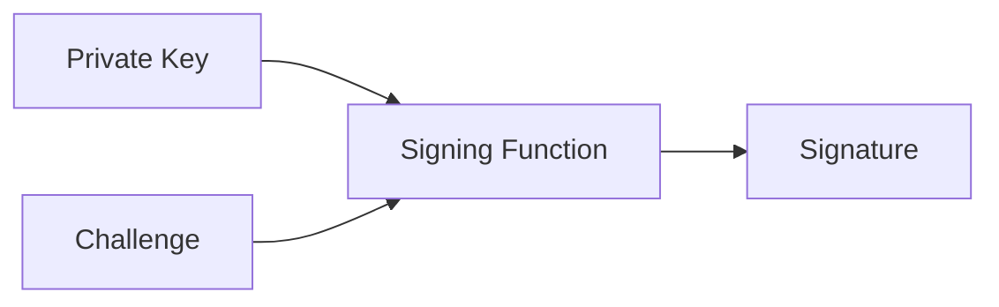

#course_cs50

- The science of encrypting information
- Encryption: scrambling information so only you and the recipient can read it. Note that we are scrambling it with the goal of allowing it to be unscrambled by the desired recipient.

# Secret key cryptography

- The sender and receiver both have the same key/secret. This is a form of *symmetric cryptography* where the process of encryption is the same as the process of decryption just in reverse. 

- We want to use a *cipher*, an algorithm for scrambling information in a reversible way, to encrypt plain text into *cipher text* - your scrambled message
    - Ciphers take as input the plain text message, as well as a *key* which is generally a number that is made up of a large number of bits

- For example - considering the *Caesar cipher* (using $n = 1$ instead of $3$ which is the original)
    - Another method is to use $n = 13$ which is referred to as *ROT13*

- There are much more sophisticated ciphers used though.

- Decryption: just a reverse of the process used to *encrypt* the message.

# Public-key cryptography

- The issue with symmetric cryptography is that both parties need to know the same secret. This needs to be communicated somehow which could be inconvenient or unsafe in its own way. 
    - Although secret key cryptography is a faster process overall if everyone has the key.
    - Asymmetric cryptography (otherwise known as public-key cryptography) frees us of this constraint.
    - In this form of cryptography, each entity has a pair of keys, a public and a private key.

> [!example]
> An example is on amazon.com, if I input my credit card, I want that to be encrypted. But I don't know anyone at amazon.com to share a secret key with.

> [!note]
> When you choose a pair of public and private keys, there is a mathematical relationship between the two. However, knowing one doesn't give you any practical information about the other and it would take too long to figure out the relationship via brute force for an adversary since the numbers are so big.

- It works like this:
    - The plaintext message is encrypted using the receiver's public key. The receiver's public key is public by default, so people know what to use if they want to message that receiver securely.
    - The receiver is going to use their corresponding private key to decrypt the message.

> [!note]
> This is how [[Hypertext Transfer Protocol (HTTP)|HTTPS]] works to securely establish a channel between the user and a website. 

## Passkeys

- A new feature popping up meaning that we don't need to create usernames and passwords for websites anymore. When you visit a website for the first time, your device will generate a public-private key pair. Your device then sends the website your public key.
    - Using the same mathematic processes above, you then login by proving that you are the owner of the corresponding private key.

- When you go to login again, the website will send you a challenge in the form of some random string. If you then effectively encrypt it with your private key, you'll get back a signature.
    - That signature is then verified by the website using your public key.

> [!note]
> - In the world of encryption, you use someone's public key to send a message encrypted and they use their private key to decrypt it.
> - In the world of passkeys, you use your private key to encrypt a challenge message, and the website uses your public key to verify that the response came from you.

# End-to-end encryption

- Refers to a stronger use of encryption than most websites are using.

- If we use HTTPS to send an email, that email is safe from prying eyes on the way to the email server since it is encrypted. However, it is *not* safe from the people who are working on that email server, since it was decrypted upon receipt by the server.
- End-to-end encryption means that the message remains encrypted until it meets the eyes of the intended receiver. So only decrypted when the user sees it.

- This is in use for services like iMessage, WhatsApp, and even video conferencing apps.
    - Note there is a cost involved in terms of processing power and convenience.

# Deletion

- When you delete files - even when you 'empty the recycling bin' - the computer is not actually removing the bits underlying that file, it is simply forgetting where it is.
- This means the contents of the file are still in the file system until they get overwritten by some other process or download, and could still be accessed in some way.
    - This presents a security risk

- In secure deletion, we take the previously occupied bits and change them all to 0s or all to 1s, or some random mix.
    - However, this isn't fully robust still. Due to today's electronics and solid state devices, there might still be remnants of those files on them. These day's drives will also prevent you from changing data in certain parts if they recognise that they are failing.

## Full-disk encryption

- This technique solves this problem. The entire contents of your hard drive is scrambled until you log in (your password is used as part of the key).
- The downside is if you forget your password; you won't be able to recover your data.

> [!example]
> - This is something that can be weaponised in ransomware attacks. If a hacker gains access to an organisation's hard drives, they can encrypt the disk with a key only they know and will only decrypt it upon ransom payment.
