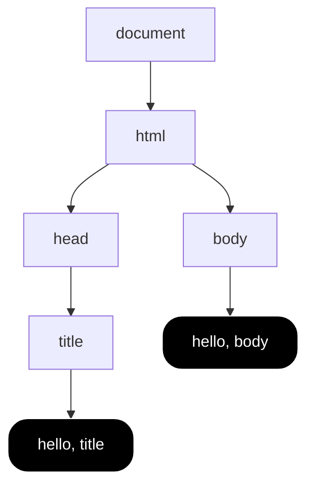

#course_cs50 

- All about aesthetics and mocking up the structure of web pages. It is a markup language (Hypertext Markup Language).
    - This gives your browser the information on what to display to you in your browser's viewport.
- There are two main concepts: tags and attributes.

- Note that HTML doesn't care about more than one whitespace, this allows us to indent our HTML prettily.

# High level example

```html
<!DOCTYPE html>

<html lang="en">
    <head>
        <title>
            hello, title
        </title>
    </head>
    <body>
        hello, body
    </body>
</html>
```

- `<!DOCTYPE html>`: document type declaration, tells the browser you're using HTML5
- `<html lang="en">`: tells the browser your HTML is now starting, this HTML tag has a `lang` *attribute*. i.e. This is the start of your `<html>` element.
    - This is terminated at the bottom of the script with `</html>` telling your browser your HTML stops here
- `<head>`: gives your browser metadata about your site, such as the title bar
- `<body>`: the actual content of your page

- Consider the following a graphical representation of the [[Document Object Model]]


# Tags

- These define discrete elements on the webpage, or pieces of metadata.

| Tag                  | Definition                                                                                                                                                                                                                                                                               |
| -------------------- | ---------------------------------------------------------------------------------------------------------------------------------------------------------------------------------------------------------------------------------------------------------------------------------------- |
| `<html>`             | Tells your browser where the HTML begins<br>- The `lang` attribute tells the webpage what language the website                                                                                                                                                                           |
| `<head>`             | A place for you to define metadata about your site, including the site title                                                                                                                                                                                                             |
| `<head>/<title>`     | Where you define your site title                                                                                                                                                                                                                                                         |
| `<body>`             | Where you place the visible aspects of your website                                                                                                                                                                                                                                      |
| `<p>`                | Tells the browser when to start a paragraph                                                                                                                                                                                                                                              |
| `<div>`              | A 'division' of the page, one of the most commonly used tags used to divide the page into manageable chunks                                                                                                                                                                              |
| `<h1>`, `<hx>`       | Allows you to add headers of different levels                                                                                                                                                                                                                                            |
| `<ul>`, `<ol>`       | Tells the browser to begin an unordered or ordered list                                                                                                                                                                                                                                  |
| `<u/ol>`/`<li>`      | Denotes another list item inside a list                                                                                                                                                                                                                                                  |
| ``              | Places an image on the page<br>- The `src` attribute defines where the image lives in your file system<br>- The `alt` attribute gives alternative text                                                                                                                                   |
| `<video>`            | Place a video on the page<br>- The `controls` attribute allows the user to control the video<br>- The `muted` attribute means the video will start muted                                                                                                                                 |
| `<video>`/`<source>` | Allows you to place multiple sources to the video in your `video` element<br>- The `src` attribute defines where the video lives in your file system<br>- The `type` attribute tells the browser what type of video file is being used, e.g. `"video/mp4"`                               |
| `<a>`                | The anchor tab lets you place links on the page<br>- The `href` (hyper-reference) attribute tells the tag where you want to link to<br>- The text in between the opening and closing `<a>` tags is the display text for the link. Misleading display text can enable *phishing* attacks. |
## `<meta>`

- The `<meta>` tag sits inside the `<head>` tag and allows you to add extra metadata to the site.

### Device responsiveness

```html
<meta name="viewport" content="initial-scale=1, width=device-width">
```

- This tells the page to resize based on the device's width instead of just zooming out.
### Open Graph protocol

- This allows the site to display previews when linked from externally; this uses the [Open Graph protocol](https://ogp.me/).

```html
<meta property="og:title" content="CS50">
<meta property="og:description" content="Introduction to the intellectual...">
<meta property="og:image" content="cat.jpg">
```

## Forms

```html
<form>
    <input>
    <button></button>
</form>
```

### `<input>`

- There are several attributes that allow you to mutate the input to meet your needs.

| Attribute      | Definition                                                               |
| -------------- | ------------------------------------------------------------------------ |
| `name`         | Name of the input                                                        |
| `type`         | Type of the input, e.g. `search`, `text`, `email`                        |
| `placeholder`  | Placeholder text in the input                                            |
| `autocomplete` | Whether to allow autocomplete                                            |
| `autofocus`    | Automatically puts the cursor in the input upon page load                |
| `pattern`      | A [[Regular Expressions\|regex]] specification that the input must match |
- Note that using `pattern` isn't a great way at guarding against malicious input.
    - Having this in the HTML means that this is currently running on the client-side.
    - However, the client can go into the HTML and remove the `pattern` attribute of the input then put their own inputs in.
    - i.e. client-side validation is user-friendly but it's not secure.
## Tables

```html
<table>                     <!-- Begin table -->
    <thead>                 <!-- Begin table header -->
        <tr>
            <th>Name</th>   <!-- Begin table header cell -->
            <th>Number</th>
        </tr>
    </thead>
    <tr>                    <!-- Begin table row -->
        <td>1</td>          <!-- Begin table cell within row -->
        <td>1</td>
    </tr>
    <tr>
        <td>3</td>
        <td>4</td>
    </tr>
</table<
```

# Special symbols (HTML entities)

- e.g. `&#169;` is a copyright symbol.

# Semantic tags

- It's better to not use just `<div>`s all the time, for [[Search Engine Optimisation]] - instead we can signal the contents of each element with tags like `<header>`, `<main>`, and `<footer>`.

# Devtools

- You can edit the HTML underlying a webpage in your browser using Devtools. This is a client-side modification.

# W3: Validator

- Handy tool to ensure your HTML is syntactically correct: [validator.w3.org](https://validator.w3.org/)

# Serving HTML webpages when on a headless server

- If we had access to Chrome or another browser, we could simply double click the HTML file and it would render the webpage for us.
- However, if we're on a server like the CS50 VSCode fork, we'll need to use the `http-server` package to serve HTML files for you.

```shell
http-server

#> This gives us a link to go to that takes you to part of your file system
#>  This link also contains a port number
```

- When you update the HTML files, you need to refresh your page so that your browser requests the updated data from the server.


# Google case study

- We've seen that [[Hypertext Transfer Protocol (HTTP)#^78ae8e|you can specify user input by encoding it into the URL]]. Let's use this information to replicate Google.

```html
<!DOCTYPE html>

<html lang="en">
    <head>
        <title>search</title>
    </head>
    <body>
        <form action="https://www.google.com/search" method="get">
            <!-- q is the name of the query param -->
            <input name="q" type="search" placeholder="Query">
            <button>Search</button>
        </form>
    </body>
</html>
```

- Entering `cats` into this input takes us to `https://www.google.com/search?q=cats`.

