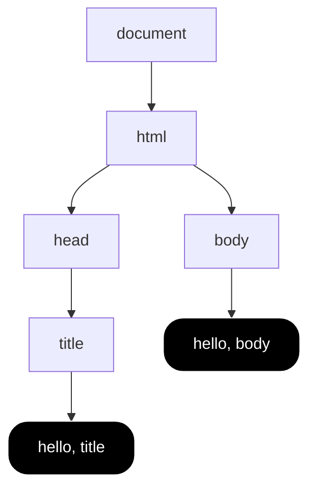

#course_cs50 

- All about aesthetics and mocking up the structure of web pages. It is a markup language (Hypertext Markup Language).
    - This gives your browser the information on what to display to you in your browser's viewport.
- There are two main concepts: tags and attributes.

- Note that HTML doesn't care about more than one whitespace, this allows us to indent our HTML prettily.

# High level example

```html
<!DOCTYPE html>

<html lang="en">
    <head>
        <title>
            hello, title
        </title>
    </head>
    <body>
        hello, body
    </body>
</html>
```

- `<!DOCTYPE html>`: document type declaration, tells the browser you're using HTML5
- `<html lang="en">`: tells the browser your HTML is now starting, this HTML tag has a `lang` *attribute*. i.e. This is the start of your `<html>` element.
    - This is terminated at the bottom of the script with `</html>` telling your browser your HTML stops here
- `<head>`: gives your browser metadata about your site, such as the title bar
- `<body>`: the actual content of your page


# Tags

- These define discrete elements on the webpage, or pieces of metadata.

| Tag              | Definition                                                                   |
| ---------------- | ---------------------------------------------------------------------------- |
| `<html>`         | Tells your browser where the HTML begins                                     |
| `<head>`         | A place for you to define metadata about your site, including the site title |
| `<head>/<title>` | Where you define your site title                                             |
| `<body>`         | Where you place the visible aspects of your website                          |
| `<p>`            | Tells the browser when to start a paragraph                                  |
| `<h1>`, `<hx>`   | Allows you to add headers of different levels                                |
| `<ul>`, `<ol>`   | Tells the browser to begin an unordered or ordered list                      |
| `<u/ol>`/`<li>`  | Denotes another list item inside a list                                      |
|                  |                                                                              |


# Attributes


# Serving HTML webpages when on a headless server

- If we had access to Chrome or another browser, we could simply double click the HTML file and it would render the webpage for us.
- However, if we're on a server like the CS50 VSCode fork, we'll need to use the `http-server` package to serve HTML files for you.

```shell
http-server

#> This gives us a link to go to that takes you to part of your file system
#>  This link also contains a port number
```

- When you update the HTML files, you need to refresh your page so that your browser requests the updated data from the server.