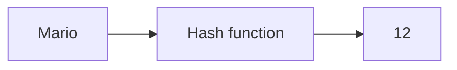

#course_cs50 

- The simplest way to think about hash tables is that they are a combination of [[Arrays|arrays]] and [[Linked Lists|linked lists]] - it is an array of linked lists.

> [!example] Phonebook example
> - In the example of a phonebook, we could have 26 array items - each representing a letter in the alphabet.
> - We could then assign individuals to each of those buckets using the first letter in their names.
> - In the case that we have more than one person with a name starting with a given letter, we use a linked list to store those multiple people under the array item.
>     - Consider this a *collision*, where two entries have the same identifying key.
>   
>   ![[Pasted image 20250208202733.png]]

- So how fast is this? Did we achieve constant time?
    - For people like Isabelle and Yoshi with only one entry under their letter, we have achieved constant time.
    - However, for Luigi, Lakitu, Link, it's not constant time. We need to get to Luigi's location then follow the linked list onwards.

> [!info] Worst case running time for searching hash tables
> - The worst case scenario is $O(n)$
>     - If all your contacts have a name starting with the same letter, then for all intents and purposes, you have just a single [[Linked Lists|linked list]]. 
>     - We then need to search each item sequentially until we find the correct individual - and in the worst case scenario, their name will be at the end of that list.

- How can we make this faster? What if we reduced the need for lengthy linked lists by increasing the number of array items?
    - In the phonebook example, say instead of just using buckets identified by single letters, say we use buckets identified by sequences of 3 letters (e.g. Laa, Lab, Lac, …). This ensures that collisions are less common.
    - Now we're back to constant time.
    - However, the tradeoff is that we now take more space in memory, we have $26^3$ possible combinations of three letters - the array is pretty large, and we can't ameliorate this by assigning new memory dynamically since we're working with arrays.

![[Pasted image 20250208203803.png]]

# Code implementation

> [!tip] Note
> - Real world hash functions will not be as simplistic as this; and the one used for hash table implementations will be chosen to put downward pressure on the probability of a collision.
>     - So *most of the time*, the running time of a hash table will be close to $O(1)$ - i.e. constant time.

```C
// Implementation of the linked list component
typedef struct node {

    char *name;
    char *number;
    struct node *next;

} node;

// Implementation of the array component - pointer to an array of 26
node *table[26];
```

- We then need a [[Hashing|hash function]] that takes a name and returns some hash or key which is also the location of the linked list containing that name. Say:



- To implement something like this in C, we can do the following arithmetic:
    - Take an argument, a word string, and store its pointer in the `word` arg
        - Add a `const` since we don't want to change the actual word inside of the function
    - Return the first letter of that word, using `toupper()` to shift it to uppercase if necessary
    - Minus capital A from it, to then get a number from 0 to 25 inclusive
    - We return this as an `unsigned int`, because this will be used as a location in an array - so it should never be negative.

```C
#include <ctype.h>

unsigned int hash(const char *word) {

    return toupper(word[0]) - 'A';

}
```

