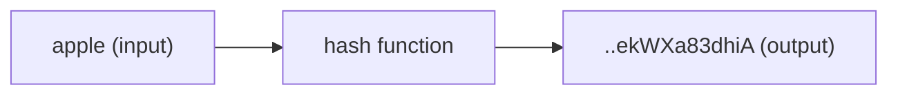

#course_cs50 

- A hash function is one that takes any number of inputs and maps them to a finite number of outputs.

> [!tip]
> When referring to function domains and ranges, it can take an infinite domain but it reduces them to a finite range.

- We can use hashing to implement [[Hash Tables]]

# In the context of passwords 

- Hashing is the process of taking an input and returning an output of a constant size. To be a successful hash function, it must go only one way (unlike [[Cryptography|encryption]]) - and the same input should yield the same hashed output every time.
    - Only going one way means it should be nearly mathematically impossible to go from output back to input.
    - Note the hash function that a company uses is not necessarily a secret - since keeping it a secret would be considered *security by obscurity*. It is best practice to use well designed hash functions and have them known.

- When a website stores a user's password, they should only be storing the hashed version of the password.
    - That way, when a user goes to log in, the password they input can be hashed with the same function and compared against the stored hashed password.

- However, there are tables called *Rainbow Tables* that map known hashed outputs to their inputs. This means that hackers, once they get their hands on a password database, can spend their time decoding what the original input was.
    - However, this is still a time consuming approach 