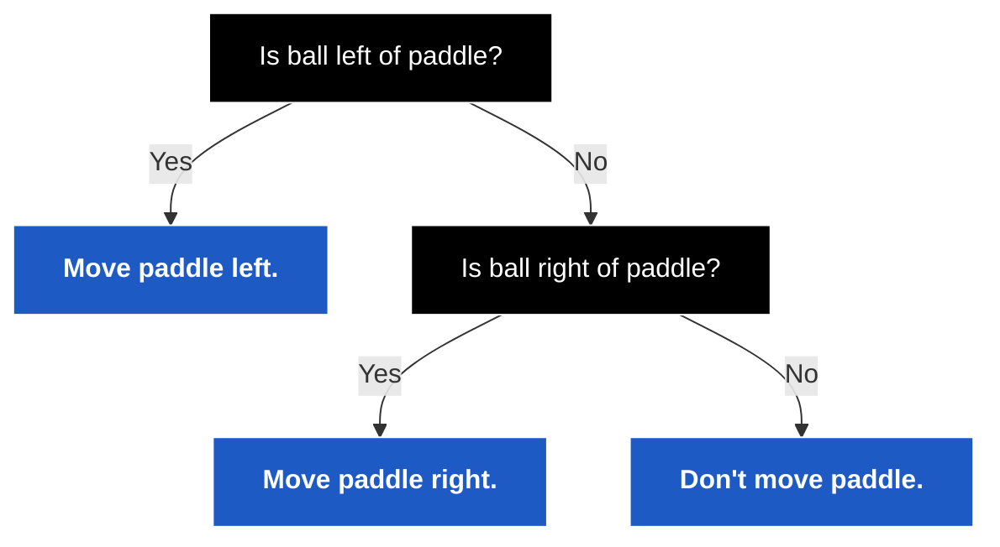
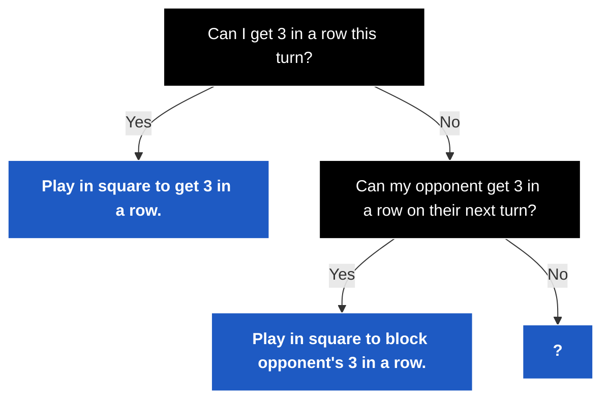

#course_cs50 

> [!example]
> AI is now all around us, with the technology enabling innovations such as the following:
> 
> - LLMS are all the rage with ChatGPT, Claude, and DeepSeek becoming popular in the last few years. CS50 also has an LLM in the form of a virtual rubber duck to help students with debugging.
>   
> - DALL-E 2 & Midjourney were all the rage in the last few years. There were some tells in the generated images in the early days - AI wasn't great at generating the finer details such as fingers.
>     - However the technology is constantly getting better, this lecture started with a deepfake video of Tom Cruise.
>     - Disinformation is going to become more challenging in a world where images and videos can be 'faked'.

# CS50's Duck Debugger

- Architecturally, here's how the ddb works.
    - A student asks questions to the `CS50.ai`.
    - A vector database containing the script of the lectures for this year as well as past homework and material is first searched and handed over to the model.
    - The question (the *user prompt*) is then also passed to Azure's OpenAI API to handle most of the LLM heavy lifting.

![[Pasted image 20250222231349.png]]

- The devs behind `CS50.ai` focused mainly on *prompt engineering* to ensure the chatbot acts like a good teacher.
    - A *system prompt* is sent to the ddb to coerce it to behave more educationally and constructive. e.g:

> You are a friendly and supportive teaching assistant for CS50. You are also a rubber duck. Answer student questions only about CS50 and the field of computer science; do not answer questions about unrelated topics… Do not provide full answers to problem sets, as this would violate academic honesty….

- The ddb has been extended to other aspects of CS50 - the goal is to approximate a 1-1 student to teacher ratio.
    - The virtual duck now also lives in `CS50.dev`, the web browser-based Visual Studio Code instance for CS50. It can now explain highlighted code.
    - It can also provide style hints as well as the reasoning behind those suggestions.
    - It can answer common questions that students may ask in the course's forums, basically providing students with 24/7 office hours.
        - Given the experimental nature of LLMs, a disclaimer is provided to the student that tells them to not take the response as fact unless 'endorsed' by a member of human staff
    - It can explain arcane error messages.

# Generative artificial intelligence

- AI is a technology that has been with us for some time, however the past 5-6 years have allowed us to take a massive leap forward in what tools such as ChatGPT can do.

> [!example]
> Examples of the use of generative AI are:
> 
> - Email spam detection
> - Handwriting detection
> - Recommendation histories in services such as Netflix
> - Siri, Google Assistant, Alexa

# Decision trees

- This is how we can start translating human intuition into a crude artificial intelligence.



- How can we use decision trees to always at least force a tie in tic-tac-toe?



# Minimax

- The reason AI is so good at games is that inputs and outputs can be represented mathematically; then a goal in the form of a function can be used to maximise/minimise the outcome.
- Minimax is one of the first algorithms that you might learn when attempting to do this. 
    - Say our goal is to minimise or maximise the total value of something.
    - If we were using tic-tac-toe as the example, we could think of each state of the game as having a certain value. e.g.:
    - We can take the board at a certain point and test the outcomes of different moves to come to a valuation of the current state.

![[Pasted image 20250223003000.png]]

i.e.

```pseudocode
If player is X:
    For each possible move:
        Calculate score for board
    Choose move with highest score

Else if player is O:
    For each possible move:
        Calculate score for board
    Choose move with lowest score
```

- However, this can become massive tree of decisions if we take into account every single state of this board. There are 255,168 possibilities for the state of a tic-tac-toe game.
    - Humans cannot handle thinking about this as well as computers can.

- Other games are even more complicated. e.g.:
    - Chess. With only the first 4 moves back and forth, there are 288 million possibilities for the state of the game
    - Go. With only the first 4 moves, there are 266 quintillion possibilities.
    - We don't have enough CPU/memory to compute these possibilities, and therefore we need a method that learns more dynamically and without so much coaching from a human.

# Machine learning

## Reinforcement learning

- Reinforcement learning is an example of machine learning in which you wait for a machine to get better and better at a task, by programming it to maximise its overall score.
    - The lecture shows a video of a robot being taught how to flip a pancake, taking 50 iterations of negative reinforcement to finally learn how to do so.
    - The lecture then also touches on the balance between [[1 RL Introduction to Reinforcement Learning#Exploration and exploitation|exploration and exploitation]] and using the [Epsilon-Greedy algorithm](https://www.geeksforgeeks.org/epsilon-greedy-algorithm-in-reinforcement-learning/) to do so.

## Deep learning

- We're trying to infer and detect patterns here even if the machine hasn't seen the pattern before - and also if the human isn't directly supervising the model.
- Neural networks are examples of this, where there are nodes/neurons that take an input and produce an output.
    - Say we provide an `x` and `y` input to a node to predict whether the data point will be red or blue.
    - How does it know whether to predict red or blue? A first approximation may be to say that anything to the left of the graph is blue, and otherwise is red.
    - But if we add more and more dots, we'll need to change our approximation to better fit the data.
    - The computer is trying to figure out what the weight of the coordinates (represented by `a` and `b`) should be; and `c` is a function that just tweaks the prediction.
        - Similar to trying to solve for $ax + by + c > 0$
        - What numbers do we have to tweak to get the answer we want?

![[Pasted image 20250223005257.png]]

- True neural networks are more complicated than just three nodes, and are composed of multiple layers of neurons.
    - These get so complex that the scientists building these don't understand what they mean, leading to difficulty in interpretability.

![[Pasted image 20250223005532.png]]

## Large language models

- A form of generative artificial intelligence that aims not to recognise patterns or classify inputs but to generate text or images.
- These are massive neural networks that have a large amount of inputs and neurons in them. These have been fed massive bodies of input such as the entire content of the internet. 
- They haven't been told how to behave, but are inferring how to behave from the input provided.

- A paper from Google in 2017 introduced the _transformer architecture_. This introduces the idea of _attention_ values where, given a sentence, you try to assign numbers to each of the words that speaks to its relationship with other words.
    - A high relationship between two words in a sentence gives them a higher attention value.
    - Encoding words this way lets us begin to predict words in a sequence.
    - Predicting the next word in a sequence was a problem for AI before this architecture was introduced since it couldn't take into account all the context.

- What's happening underneath the hood is the LLM breaks the input down into individual words. 
    - The order of those words is then encoded. 
    - Each of these words is then encoded to get _embeddings_, mathematical representations of the words
        - e.g. OpenAI uses 1,536 floating point values to represent the word _Massachusetts_.
        - These can then be used to find the proximity to other words semantically.
        - These then help to predict what the next word should be.
    - These inputs then get fed into a large neural network to get out a single word - the next word in the sequence.

![[Pasted image 20250223010731.png]]

### Hallucinations

- LLMs experience an issue referred to as hallucinations whereby they say things with confidence that are simply not correct.
    - These are a consequence of the LLM being a probabilistic model.
- This problem will get less and less frequent as the models evolve.