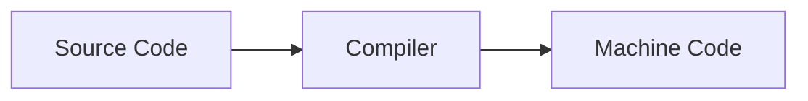

#course_cs50 

- If a machine can only read binary in the end, how is it reading our instructions?
- The code we write must be *compiled* into machine-readable format; which takes our source code, and converts into machine code.
    - More generally, a compiler is a process that takes one language and converts it into (any) other.

