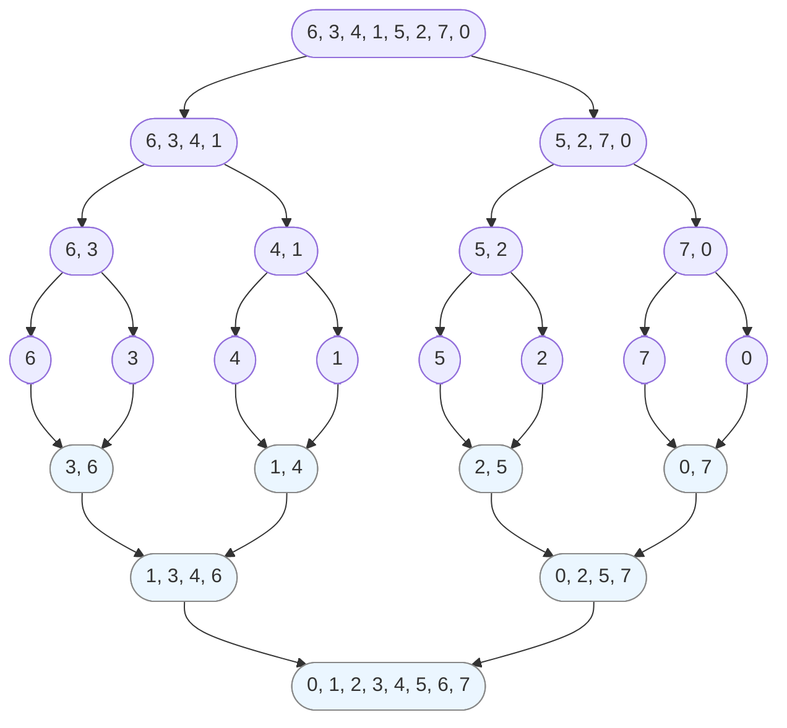

#course_cs50 

# Selection sort

- Here, we start at the left of an array and move to the right - making a note of the smallest number seen.
    - We then swap the positions of the smallest number and the left-most number.
    - We then repeat this for all numbers to the right of the first one, and onwards until the array is swapped.
- Note that this is memory efficient since we only keep one number in memory - the smallest seen so far this pass.

- In pseudocode:

```pseudocode
For i from 0 to n-1
    Find smallest number between numbers[i] and numbers[n-1]
    Swap smallest number with numbers[i]
```

- This algorithm is doing a lot of work because it keeps needing to go back and forth. 
    - If there's $n$ numbers to start, we do $n-1$ comparisons in the first pass. The second time we do $n-2$, so we end up with the following
    - Note that with $O(n)$ notation we mainly take the highest power term since that will contribute the most to runtime as the number of inputs increases

$$(n-1) + (n - 2) + … + 1 = n(n-1)/2 \approx O(n^2)$$
- This is slow. Selection sort also doesn't take into account whether the list is already sorted - so the upper bound equals the lower bound, hence selection sort has $\Theta(n^2)$ ([[Running Time - O(n)#^c6c454|see Running Time]]).
# Bubble sort

- Here, we do pairwise comparisons. We first look at the first and second numbers. If the second number is smaller than the first, we swap their positions. Then we'll check the second and third etc. 
    - Whenever we move a number to the left, we then check that same number against the number to the left of it again
    - The smallest number "bubbles" up to the start of the array.

- In pseudocode:

```pseudocode
Repeat n-1 times
    For i from 0 to n-2
        If numbers[i] and numbers[i+1] out of order
            Swap them
```

- The running time is $(n-1) \times (n-1)$ since we're repeating the outer loop $n-1$ times, and doing $n-1$ comparisons in each pass.
    - Hence $O(n^2)$. Asymptotically, similar to Selection Sort.

 - However, we could abort Bubble Sort early if there are no swaps required in each iteration
     - In this case, we get $\Omega(n)$.

```pseudocode
Repeat n-1 times
    For i from 0 to n-2
        If numbers[i] and numbers[i+1] out of order
            Swap them
        If no swaps
            Quit
```

# Merge sort

- This sorting algorithm utilises [[Recursion|recursion]] to come up with a more efficient algorithm than the first two.
    - The previous two sort algorithms were memory-limited in that they only tracked the smallest number at any given time.
    - However, if we want speed we need to trade off how much memory we use - which leads to this sort.

```pseudocode
If only one number
    Quit
Else
    Merge sort left half of numbers
    Merge sort right half of numbers
    Merge sorted halves
```

- Merging in this case involves pairwise comparisons of each element of each half of the dataset. We take the smallest number first, then the larger number - then move on to the next pair.
    - This merging is where the actual sorting happens.



- Note that the recursion means that we don't need to operate over so many iterations.
    - Since we're dividing the list into half until we're getting 1 number in each array - so the number of times we need to operate (the height) is $log_{2}8 = 3$.
    - Every time we divided, we needed to take each set of numbers and merge them together - so at each step there were $n$ steps.
    - More generally, the total running time is $nlog_{2}n$; which, once we remove the constant, is $O(n log (n))$.
    - It is also $\Omega(n log (n))$ since it doesn't matter if the list was sorted to begin with. This means that Bubble Sort can sometimes outperform this if the list is already sorted or the list is very small.
    - In general, it is much better than the previous two algorithms.