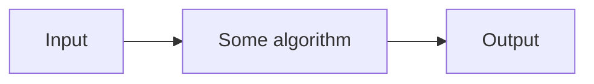

#course_cs50 

- Study of information
- Solving problems with certain ideas and techniques
- Problem solving is a goal we'll approach with **computational thinking**

# Problem solving

- Problem solving is no more than taking an input and using it to create an output
- Before we solve and problems, we need to figure out how do we represent these inputs and outputs?
    - English?
    - Computers only know 0s and 1s, so [[Binary]]?
        - Everything in the end is represented through binary, so you need to tell the computer what you want it to 
        - We have [[ASCII]] & [[Unicode]] for language & [[RGB]] for colour and from that, images
        - We could represent sound with numbers for tone, pitch, and loudness (MIDI?)
        - Video can be represented as many images

- Turning our attention to the algorithm, which is a step by step instruction for solving some problem. i.e. Code, which is the implementation of algorithms with computers.

# Scratch demo

- Scratch comes with a cat sprite who you can control using code, which itself is represented with puzzle pieces.
- This lesson focused on certain aspects of writing code:
    - Do not repeat yourself; that increases margin for error and inefficiency
    - Abstract away complex or neatly encapsulated logic into functions
    - Arguments to functions to make functions more flexible