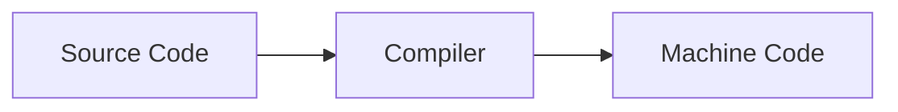

#course_cs50 



- When we want to compile and execute our C code, we run the following commands:

```shell
make hello
./hello
```

- However, `make` itself is not a compiler, and is instead an abstraction using another command under the hood - `clang`:

```shell
clang hello.c
./a.out # Default return name of clang (a for Assembly)
```

- To make this a little more useful, we can pass [[Linux Terminal | CLI]] arguments:

```shell
clang -o hello hello.c
./hello
```
# Including external libraries

- If we need to include external libraries such as `cs50.h`, we get a `linker command failed with exit code 1` error. To properly link the library we'll need to add further arguments:

```shell
# Argument: -l<library name>
clang -o hello hello.c -lcs50
```

# Compiling process

- The act of compiling (running `make` or `clang`) is really the process of 4 main steps.
## Preprocessing

- This is the act of catching errors in the code itself. It does things like catching if functions have not been defined (and if they are - whether their [[C#^4d6eb2 | prototype]] is correctly added)
- It also handles the `#include` lines at the top of the script. 
    - When it comes to what's in `cs50.h`, all that's in there is the prototype of the functions like `get_string()`. 
    - The `clang` compiler sees the `#include` lines, and - in a sense - copies the contents of `cs50.h` to the top of the script.
    - i.e. It converts these lines to the prototypes of the functions in these libraries.
## Compiling

- The code then gets compiled/converted into Assembly code - a lower level language; however this is still not machine code.

```Assembly
...
main: # @main
    .cfi_startproc

# BB#0:
    pushq %rbp
.Ltmp0:
    .cfi_def_cfa_offset 16
.Ltmp1:
    .cfi_offset %rbp, -16
    movq %rsp, %rbp
.Ltmp2:
    .cfi_def_cfa_register %rbp
    subq $16, %rsp
    xorl %eax, %eax
    movl %eax, %edi
    movabsq $.L.str, %rsi
    movb $0, %al
    callq get_string
    movabsq $.L.str.1, %rdi
    movq %rax, -8(%rbp)
    movq -8(%rbp), %rsi
    movb $0, %al
    callq printf
    ...
```

## Assembling

- This step takes Assembly code and converts it to binary 0s and 1s - instructions a machine can read.
## Linking

- Somewhere on the hard drive there is a `cs50.c` and a `stdio.c` file, that contains the implementations of all the functions in these libraries (recall before we only included the prototypes).
- This means when we're compiling, we're really combining three files: `hello.c`, `cs50.c`, and `stdio.c`. `clang` needs to convert each of these files into 0s and 1s.
- The linking step takes all the 0s and 1s from each file and combines them intelligently into a single file.

# Decompiling

- It stands to reason that we can take machine code and reverse engineer it the source code, allowing us to modify applications for our own purposes.
- However, there are many ways to write code, and decompiling may not be straightforward since you lose variable names etc.
    - There are also ethical concerns about intellectual property.