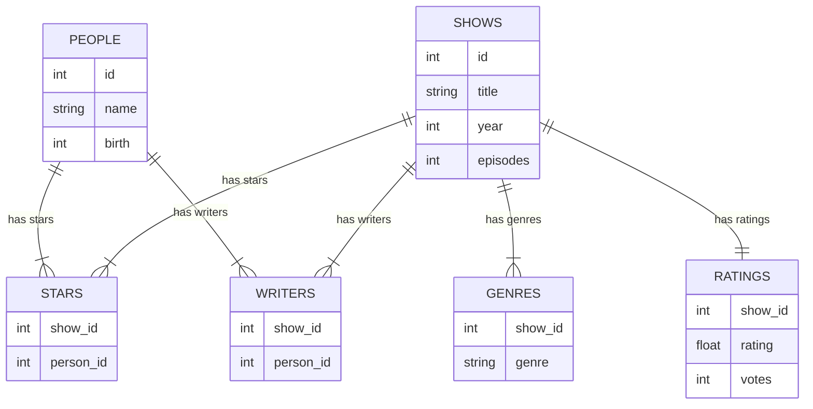

#course_cs50 

- Python isn't the most pleasant way to deal with data at scale. Structured Query Language (SQL) is a database-centric language used to query databases.
    - In CS50, we'll be using a light version of SQL, `sqlite3`, which contains the core building blocks of SQL.
    - Note that there's a lot of different SQL vendors and so different platforms such as Oracle and Teradata may have slightly different syntaxes and extra functionality.

- The commands used in SQL correspond closely to the concept of [[Relational Databases#CRUD|CRUD]]. e.g.:

```SQL
"Create"  : CREATE, INSERT
"Retrieve": SELECT
"Update"  : UPDATE
"Delete"  : DELETE, DROP /* (a whole table) */
```

- Note missingness is represented by `NULL` in SQL.
# How do you run `sqlite3`?

- Let's load a [[Relational Databases#^b38c8a|flat file]] into this database for analysis.

```shell
# Create a new database - this will be a binary file
sqlite3 favourites.db

# We now want to import a CSV using the sqlite interpreter we've been put in
#sqlite> .mode csv
#sqlite> .import favourites.csv favourites # <filename> <tablename>
#sqlite> .quit
#$ ls
# favourites.csv favourites.db

# Let's get back into sqlite3
#$ sqlite3 favourites.db
#sqlite> .schema # Shows the command used to create the database
# CREATE TABLE IF NOT EXISTS "favourites"(
# "Timestamp" TEXT, "language" TEXT, "problem" TEXT);
#sqlite> SELECT * FROM favourites;
# ...
#sqlite> SELECT language FROM favourites;
# ...
```

## Other SQLite functionality

- Use `.timer ON` to turn a 
# Relational databases

- It is common to use Comma Separated Values (CSV) to store data in separate tables. These are referred to sometimes as *flat files* given they only have a 2 dimensional structure. ^b38c8a
- Relational databases are more advanced than flat files, and instead are pieces of software running on a computer or a server holding a lot of tables that may be related to each other. 
- These can be queried with SQL.

## CRUD

- This stands for Create, Retrieve, Update, Delete. In a relational database you can really only do these four operations.

# Basic SQL operations
## Retrieving
### `SELECT`

- Use `SELECT` to select certain or all columns from a table

```sql
SELECT * FROM table;                 /* Select all columns */
SELECT COLUMNX, COLUMNY FROM table;  /* Select these two columns from the table */
SELECT DISTINCT(COLUMNX) from table; /* Get all distinct values from COLUMNX */
SELECT COUNT(*) FROM table;          /* Count rows in table */
```

## Creation

### `CREATE TABLE`

- When creating a table, you have discretion over the name, and the data types in each column of the table.

```SQL
CREATE TABLE table (column type, ...);
```

### `INSERT INTO`

- We can insert rows into a table with the following

```sql
INSERT INTO favourites (language, problem) 
VALUES      ('SQL', 'Fiftyville');
```

## Update

- This is us mutating the table:

```sql
UPDATE table SET column = value WHERE condition;

/* e.g. - this updates ALL rows to these values */
UPDATE favourites SET language = 'SQL', problem = 'Fiftyville';
```

## Delete

- We can delete rows like this:

```SQL
/* DO NOT RUN THE FOLLOWING 
   This deletes everything from the favourites table */
DELETE FROM favourites;

DELETE FROM favourites WHERE Timestamp is NULL;
```

# Predicates

- These are statements we can layer on to our base query to modify how it behaves.

```sql
WHERE    /* Filtering */
LIKE     /* Filtering */
ORDER BY /* Arranging */
LIMIT    /* Limiting rows */
GROUP BY /* Grouping for grouped operations */

/* e.g. */
SELECT COUNT(*) FROM favourites 
WHERE language = 'C' AND problem = 'Hello, World';
```

- To replicate the functionality in the [[Python#Opening and analysing CSVs|Python example]] of counting how many language responses there were and sorting by descending order:

```sql
SELECT   language, 
         COUNT(*) AS n
FROM     favourites 
GROUP BY language 
ORDER BY n DESC;
```
# Other functions
## Mathematical operations

```sql
AVG
COUNT
MAX
MIN
...
```

## String operations

```sql
UPPER
LOWER
NCHAR
```

# IMDb case study

- Sites like IMDb are passing your search strings into a SQL query to then return the results of your search.

## Schema design / Normalisation

- The lecturer started the example off by trying to model data for TV shows and by starting by placing the different starring actors in each column.
    - The issue is when there are a highly variable number of starring actors, causing a blowout in the number of columns and some TV shows to have a lot of `NULL` entries.

| title      | star         | star         | star           | star          | star       |
| ---------- | ------------ | ------------ | -------------- | ------------- | ---------- |
| The Office | Steve Carell | Rainn Wilson | John Krasinski | Jenna Fischer | B.J. Novak |

- Here's a better way to do this - have a [tidy table](https://r4ds.had.co.nz/tidy-data.html). However, we're now repeating the title of the show multiple times.

| title      | star           |     |
| ---------- | -------------- | --- |
| The Office | Steve Carell   |     |
| The Office | Rainn Wilson   |     |
| The Office | John Krasinski |     |
| The Office | Jenna Fischer  |     |
| The Office | B.J. Novak     |     |
- What if we have multiple tables, each related to each other, that are each at a different 'level' of granularity. e.g.:

**Shows table**

| id     | title      |
| ------ | ---------- |
| 386676 | The Office |

**People table**

| id      | name           |
| ------- | -------------- |
| 136797  | Steve Carell   |
| 933988  | Rainn Wilson   |
| 1024677 | John Krasinski |
| 278979  | Jenna Fischer  |
| 1145983 | B.J. Novak     |

**Stars table**

| show_id | person_id |
| ------- | --------- |
| 386676  | 136797    |
| 386676  | 933988    |
| 386676  | 1024677   |
| 386676  | 278979    |
| 386676  | 1145983   |
- Now none of these sheets have the big picture, but this is the right way to implement data if your goal is to have a canonical source of truth for every show and person:
    - You only say the show's name once in one place
    - You only say the TV star's name once in one place
    - And you relate each one with each other with the **Stars** table, allowing you to change those relationships by just changing them in one place

- Note this is similar in spirit to what we had before, but since each [[Memory|integer is only 4 bytes]], this takes much less space than the character strings being repeated (recall each character itself is 1 byte).

- This structure is no longer as *immediately* useful as the original table since you need to piece together each table to get a useful view. However, this method of *normalising* the data factors out any duplication that might have been present.

## Entity-Relationship Diagrams

- Here is an *Entity-Relationship Diagram* that shows how IMDb has structured their data.
    - `||--||` means a one-to-one relationship; i.e. every show has one rating
    - `||--|{` means a one-to-many relationship; i.e. shows can have more than one writers
        - This is what allows us to get rid of the 'stars-in-the-columns' issue we were grappling with at the start of the example. We can move the stars into a row each, allowing the show to have any arbitrary number of stars.
    - `}|--|{` means a many-to-many relationship


- So knowing this structure, we can do things like:

```sql
SELECT * FROM shows lIMIT 10;

/*
+-------+------------------------------+------+----------+
|  id   |           title              | year | episodes |
+-------+------------------------------+------+----------+
| 62614 | Zeg 'ns Aaa                  | 1981 | 227      |
| 63881 | Catweazle                    | 1970 | 26       |
| 63962 | UFO                          | 1970 | 26       |
| 65269 | Ace of Wands                 | 1970 | 46       |
| 65270 | The Adventures of Don Quick  | 1970 | 6        |
| 65271 | Albert and Victoria          | 1970 | 12       |
| 65272 | All My Children              | 1970 | 9691     |
| 65273 | Archie's Funhouse            | 1970 | 23       |
| 65274 | Arnie                        | 1970 | 48       |
| 65276 | Barefoot in the Park         | 1970 | 12       |
+-------+------------------------------+------+----------+
*/

SELECT COUNT(*) FROM shows;

/*
+----------+
| COUNT(*) |
+----------+
| 217314   |
+----------+
*/
```

## `SHOW CREATE TABLE`-equivalent

- Here's how we can see the `CREATE TABLE` statement behind a show

```sql
/* sqlite> .schema shows */
CREATE TABLE shows (
    id INTEGER,
    title TEXT NOT NULL, /* Cannot be NULL */
    year NUMERIC,
    episodes INTEGER,
    PRIMARY KEY(id)
);

/* sqlite> .schema ratings */
CREATE TABLE ratings (
    show_id INTEGER NOT NULL,
    rating REAL NOT NULL, /* A float */
    votes INTEGER NOT NULL,
    /* Allows us to link to the shows table */
    FOREIGN KEY(show_id) REFERENCES shows(id) 
)
```

## SQL data types

- We have the following data-types in SQL
    - `BLOB`: Binary Large Object - a file or some piece of data that's zeros and ones
    - `INTEGER`
    - `NUMERIC`: Dates and times, numbers but not necessarily integers or floating point values
    - `REAL`: Floats
    - `TEXT`
- There are even more datatypes in other databases, but these are basically representative of them.

- We can add some further qualifiers to data types when creating the table:
    - `NOT NULL`: Ensures that you cannot have a `NULL` value in this column
    - `UNIQUE`: Cannot have duplicate values in this column


## Keys

- These map out the relationship between tables in a relational database.

### Primary keys

- In the People table, we had an integer ID column that uniquely identified every person in that table. Each ID only appeared once in the table.

### Foreign keys

- In the Stars table, we had multiple ID columns with IDs that originated from other tables, such as the People ID column. In this sense, they are *foreign keys*, they are primary keys that did not originate from this table but are being used here.
- In this context, they are allowed to appear more than one time.

- These keys allow us to relate tables to each other. For example, getting the name of all shows that have a rating greater than or equal to 6.0:

```sql
SELECT title 
FROM   shows 
WHERE  id in (
    SELECT show_id 
    FROM   ratings
    WHERE  rating >= 6.0
    LIMIT  10
);
```

- However, this doesn't allow us to also include the ratings information. To do that, we'll need joins.

## Joins

- The keys we discussed above also allow us to *join* tables together.

```sql
SELECT title, rating
FROM   shows 
JOIN   ratings /* This is an INNER join by default */
    ON shows.id = ratings.show_id
WHERE  rating >= 6.0 lIMIT 10;
```

- The available types of joins are as follows:

```sql
(INNER) JOIN
LEFT (OUTER) JOIN
RIGHT (OUTER) JOIN
FULL (OUTER) JOIN
```

- An example for taking the **Stars** table and using it to find what show is related with what person.

```sql
SELECT name
FROM   people
WHERE  id IN (
    SELECT person_id 
    FROM   stars 
    WHERE  show_id = (
        SELECT id
        FROM   shows 
        WHERE  title = 'The Office' 
            AND year = 2005
    )
);

/* A better way using joins... */
SELECT DISTINCT people.name
FROM   people
JOIN   stars 
    ON people.id = stars.person_id
JOIN   shows 
    ON stars.show_id = shows.id
WHERE shows.title = 'The Office'
    AND shows.year = 2005;
```